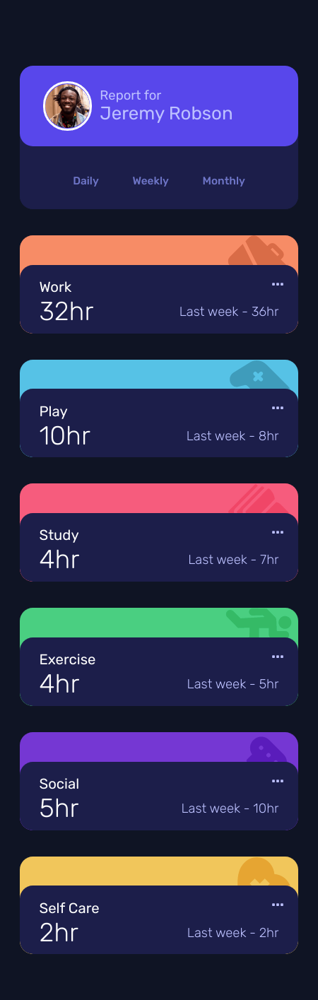
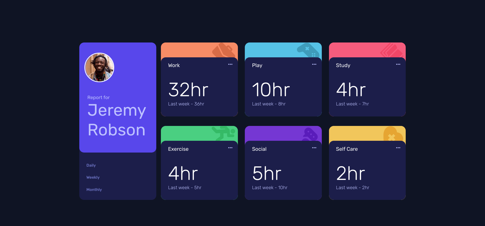

# Frontend Mentor - Time tracking dashboard solution

This is a solution to the [Time tracking dashboard challenge on Frontend Mentor](https://www.frontendmentor.io/challenges/time-tracking-dashboard-UIQ7167Jw). Frontend Mentor challenges help you improve your coding skills by building realistic projects. 

## Table of contents

- [Overview](#overview)
  - [The challenge](#the-challenge)
  - [Screenshot](#screenshot)
  - [Links](#links)
- [My process](#my-process)
  - [Built with](#built-with)
  - [What I learned](#what-i-learned)
- [Author](#author)

## Overview

### The challenge

Users should be able to:

- View the optimal layout for the site depending on their device's screen size
- See hover states for all interactive elements on the page
- Switch between viewing Daily, Weekly, and Monthly stats

### Screenshot

* Mobile

* Desktop

### Links

- Solution URL: [Add solution URL here](https://your-solution-url.com)
- Live Site URL: [Live site](https://admiring-joliot-44ee42.netlify.app/)

## My process

### Built with

- Vue & VueX
- Sass 
- Flexbox
- CSS Grid
- Mobile-first workflow

### What I learned

* I think subgrid is the best solution for this challenge, but it still not support, so I build a grid inside a flexbox

## Author

- Frontend Mentor - [@tin-pham](https://www.frontendmentor.io/profile/tin-pham)
- Mail - shin.akarat@gmail.com

